## Wolf Skulls

### Discriminant and Classification Analysis
The following analysis explores physical variation of the wolf population inhabiting different geographical areas. In addition, differences between male and female wolves would be studied. To accomplish this task, we will develop discriminant functions to find dimensions where easy separation of wolf groups is possible. Based on the findings, we will develop classification functions to categorize new data points containing wolf skull measurements.

The data used for the analysis consists of 25 wolf skulls collected from different geographical areas. Each skull is described by 10 characteristics. Continuous variables are responsible for measurement of skull features which are recorded in centimeters. There are 9 continuous variables in total. The remaining 2 variables are categorical in nature. The first one “location” describes wolf’s geographical spot: “rm” for Rocky Mountains and “ar” for arctic. The second one is binary sex variable with the following abbreviations: “m” for male and “f” for female. There is additional variable called “wolves” which acts as label for the observations. All records are complete, and there are no missing or incorrectly inputted measurements.

We will now perform discriminant analysis concluded with classification to determine if we can separate wolves based on sex and geographical area. In our analysis, we will combine two categorical variables into one. Starting with sex variable (‘male’ and ‘female’) and location variable (‘arctic’ and ‘Rocky Mountains’), we have created a new variable wolf_cat with the following categories:

	* RM F – female wolves living in Rocky Mountains 
	* AR F – female wolves living in Arctica
	* RM M – male wolves living in Rocky Mountains
	* AR M – male wolves living in Arctica

Our aim is to create discriminant functions which would allow us to separate 4 categories above and then perform classification on new data. The first step would be extraction of eigenvalues and associated eigenvectors from __E(-1) H__ to acquire directions where categorized groups of wolves could be maximally separated. Then, we will evaluate each direction if the separation is actually significant. We will start by writing out both the eigenvalues and associated eigenvectors from the data. Since we have 4 groups and 9 variables, the number of eigenvalues is equal to:

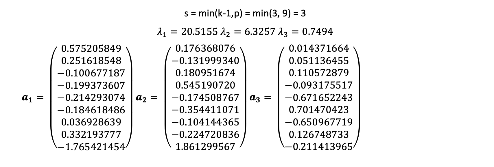

Next, we will evaluate significance of each direction with the following null hypothesis:

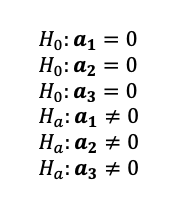

Failure to reject the null hypothesis would mean that the given direction is insignificant and could not be used to separate groups of wolves. Before running the test, let us first look at the eigenvalues themselves since they carry information about significance of separation done by corresponding eigenvector in a given direction. We see that λ1 is significantly bigger than the remaining eigenvalues with the following proportion:

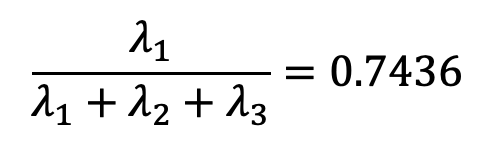

The second eigenvalue also has substantial proportion of the total:

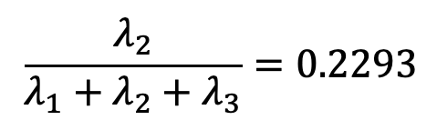

With the last eigenvalue having the least impact:

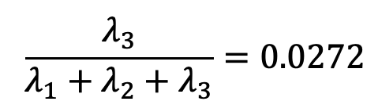

Thus, without running any tests yet, we can sense that the data would be largely separated using just two dimensions. Let us now confirm our observation by running the test of significance using Wilks test:

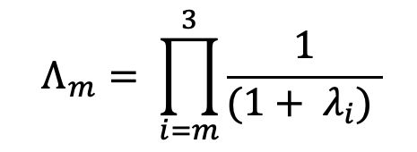

After computation, we have the following scores:

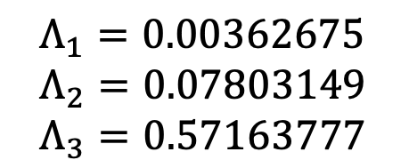

We will use F-approximation for each Λm to evaluate the significance with p = 9 and k = 4.

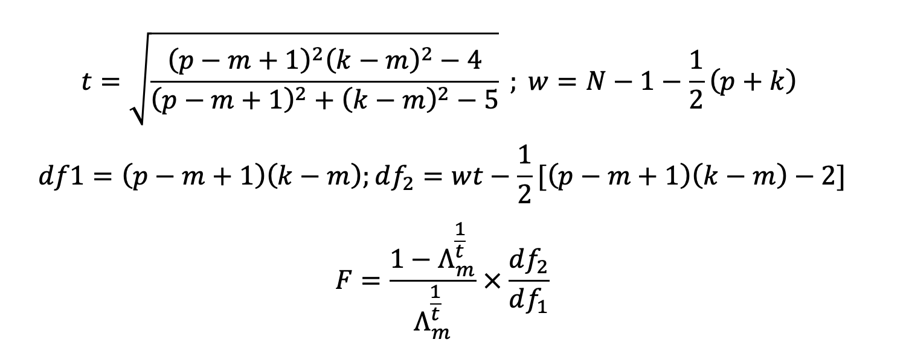

After calculations, we have the following results:

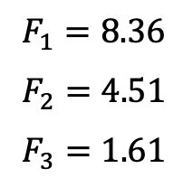

We see that for F1 and F2 the p-values 0.0001 and 0.0003 are below the alpha significance level of 0.05. Whereas the last F3 is above with the corresponding p-value of 0.2086. Thus, we can conclude the rejection of null hypothesis for __a1__ and __a2__ and failure for __a3__.

Our initial assumptions turned out to be true with two directions that could significantly separate groups of wolves and the last one which failed to do that. Each direction can be represented as discriminant function z that is a linear combination of components coming from eigenvector __a__ and our X1-X9 variables. By using the discriminant functions z, we can project wolf observations into our new significant dimensions and separate them into discrete groups. For instance, the dimension for λ1 can be represented using the following z discriminant function.

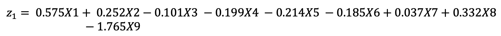

In addition, the absolute value of coefficients informs us about the contribution of each variable into wolf separation. Thus, for z1, the palatal length plays significant role in separation of groups, whereas in z2 it is the palatal width. The end result can be visible in the plot below where x axis is the dimension coming from z1 and y axis from z2.

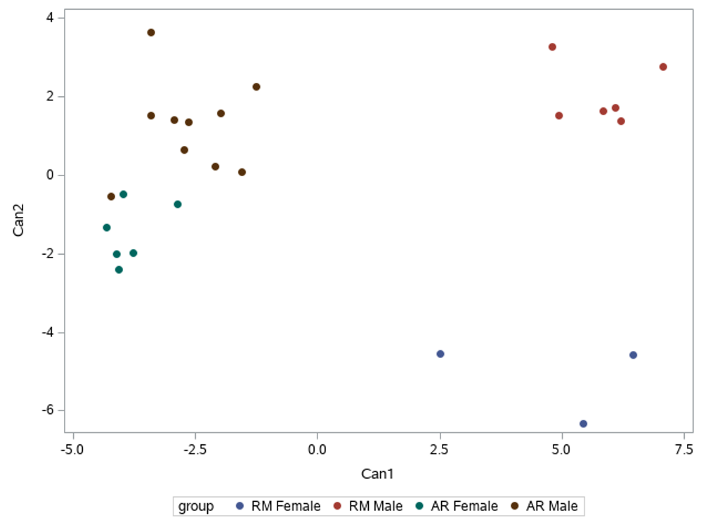

Looking at the plot, we see that all four groups can be separated linearly with only slightly overlap in arctic female and male wolves.

Our next task is to compute linear classification functions which would allow us to categorize new data into appropriate wolf groups. We assume that all four groups have equal covariances. First, we compute mean vectors __y-bark__ for each group alongside with pooled sample covariance matrix __Spl__. Then, we will use the following classification functions for categorization.

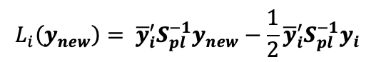

Where ynew is our new observation which we want to categorize and i = 1,…,k. The function Li (__ynew__) which yields the largest value assign the category. For instance, classification function for arctic female wolves has the following structure (using all data):

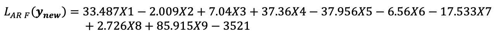

After computing all the classification functions, we need to evaluate their performance by looking at the probability of misclassification. For this task, we will use the Holdout method. We have split our data into training set which is used for building classification functions and test set used for evaluation. Since our data is limited in size, we will perform resampling where each observation (test set with cardinality of 1) is classified by functions based on the remaining observations (training set with cardinality of n-1). Below is the classification table:

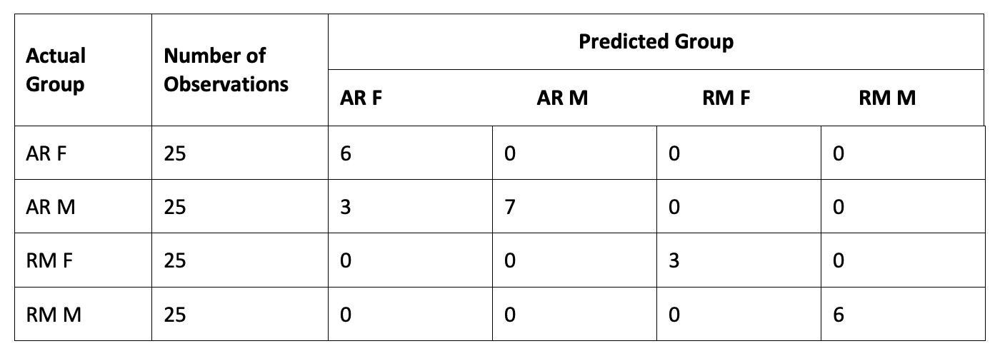

Error rate using the holdout method is: 3/25 = 0.0750

There were only three observations which were misclassified by our classification functions. Unfortunately, we are very limited with our testing set. However, looking at discriminant functions plot our classification prospects are optimistic. Going back to our initial question whether there are differences between wolves of different sexes coming from different geographical areas, the answer to this question is positive. Based on our findings from Discriminant analysis, we were able to find differences based on animal sex and place of living. In addition, discriminant plot displayed distinctive separation of wolves groups. 
